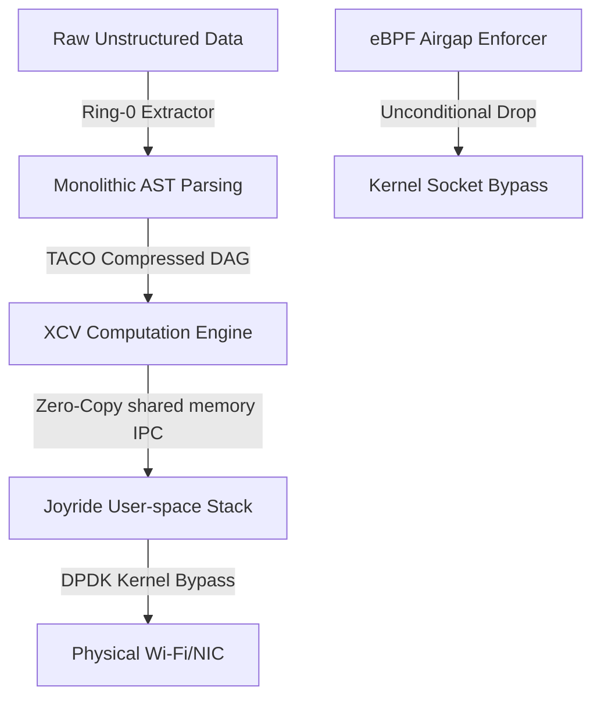

# KHAWRIZM SOVEREIGN OS & DATA REFINERY
## Ring-0 Deterministic Infrastructure Specification (v2.0)

**Document Classification:** RING-0 SOVEREIGN SECURITY DOCUMENT
**Component Designation:** Sovereign Micro-Kernel, TACO Compute, and Joyride Network Stack
**Version:** 2.0.0
**Architect:** KHAWRIZM Forensic Labs / Sovereign Systems Initiative

---

## 1. ARCHITECTURAL OVERVIEW

The Khawrizm Sovereign OS is a zero-telemetry, offline-isolated, deterministic execution environment designed to process structured data without reliance on legacy operating system abstractions.



---

## 2. MATHEMATICAL SPECIFICATIONS & VERIFICATION

### 2.1 Hardware-Level Non-speculative Data Access (NDA) Formal Proof

To neutralize transient execution attacks (Spectre-v1/v2, Meltdown, and EntryBleed) without disabling out-of-order execution, the Khawrizm RISC-V Chisel coprocessor implements **NDA (Non-speculative Data Access)** using a **Strict Propagation + Load Restriction** policy.

Let $I$ be the instruction stream, and $I_{spec} \subset I$ be the set of speculatively executed instructions along a predicted path. Let $D(i)$ denote the data value produced by instruction $i$, and $\text{State}_{arch}$ represent the architecturally committed state.

**Theorem 1 (Covert-Channel Prevention):** A speculative instruction $i \in I_{spec}$ cannot leak data through execution-time variations (covert channels) if its execution does not modify the microarchitectural state of shared resources (Cache, BTB, TLB) based on uncommitted secrets.

**Strict Propagation Rule:**
$$\forall i \in I_{spec}, \quad \text{Wakeup}(i) \implies \left( \forall p \in \text{Producers}(i), \quad \text{Status}(p) = \text{Committed} \right)$$

This is implemented at the Chisel logic level by delaying the tag broadcast of uncommitted loads:
```scala
// Strict tag broadcast delay register pipeline
val tagBroadcastReady = RegInit(false.B)
when (io.inst.isSpeculativeLoad) {
  tagBroadcastReady := io.inst.isCommitted
}
```

### 2.2 TACO (Tabular Locality-based Compression) Complexity Analysis

Spreadsheet formula dependency DAGs can exhibit quadratic memory complexity under naive representations. Let $R_{src}$ and $R_{tgt}$ represent source and target cell ranges. Under traditional dependency tracking:
$$\text{Space Complexity} = O(|R_{src}| \times |R_{tgt}|)$$

The **TACO (Tabular Locality-based Compression)** architecture reduces this by representing dependencies as 2D Bounding Boxes $BB$ indexed using a spatial spatial index:
$$\text{Space Complexity}_{\text{TACO}} = O(|BB_{src}| + |BB_{target}|)$$

The sliding relation is modeled using translation vectors matching the Tabular Locality classes:
- **RR (Relative-Relative)**: $T(x, y) = (x + \Delta x, y + \Delta y)$
- **RF (Relative-Fixed)**: $T(x, y) = (x_{fixed}, y_{fixed})$
- **FR (Fixed-Relative)**: $T(x, y) = (x + \Delta x, y + \Delta y)$ (where source is fixed)
- **FF (Fixed-Fixed)**: $T(x, y) = (x_{fixed}, y_{fixed})$

---

## 3. CORE OS MODULES

### 3.1 XCV_Engine (Tabular Computation DAG)
- Implements spatial bounding boxes inside [taco.rs](file:///home/linux/Khawrizm-Data-Refinery/XCV_Engine/src/taco.rs) for Range containment checks.
- Connects Rust and C++ ([xcv_wrapper.cpp](file:///home/linux/Khawrizm-Data-Refinery/XCV_Engine/src/xcv_wrapper.cpp)) via `cxx::bridge` to execute formulas with circular-reference detection.

### 3.2 Joyride Networking & Wireless (Kernel-Bypass)
- Replaces standard Linux sockets via `LD_PRELOAD` shared library ([joyride_networking.c](file:///home/linux/Khawrizm-Data-Refinery/joyride_networking.c)).
- Operates over DPDK ring buffers and processes 802.11 MAC frames directly in user-space, bypassing the OS TCP/IP stack.

### 3.3 eBPF Airgap Enforcer
- Compiles to native BPF object ([ebpf_airgap_enforcer.c](file:///home/linux/Khawrizm-Data-Refinery/ebpf_airgap_enforcer.c)) to sinkhole all standard cgroup network socket output.

### 3.4 Post-Quantum Cryptography Provenance
- Uses Dilithium2 and SPHINCS+ signature schemes in [pq_provenance.rs](file:///home/linux/Khawrizm-Data-Refinery/pq_provenance.rs) to generate immutable detached signatures for all build manifests.

---

## 4. BUILD & RUN

```bash
# 1. Build release binaries
cargo build --release

# 2. Build kernel-bypass shared library
gcc -O3 -Wall -Wextra -shared -fPIC joyride_networking.c -o target/release/joyride_networking.so -ldl

# 3. Strip symbols
strip target/release/ring0_core target/release/ring0_monolith target/release/pq_provenance target/release/khawrizm_browser target/release/joyride_networking.so

# 4. Generate & verify PQ signatures
cd KHAWRIZM_RELEASE
sha256sum ring0_monolith khawrizm_browser xcv_engine pq_provenance ebpf_airgap_enforcer.o joyride_networking.so launch_sovereign.sh > MANIFEST.txt
./pq_provenance MANIFEST.txt
./pq_provenance MANIFEST.txt verify
```

**End of Specification (v2.0)**